# UNIDAD 5. Memorias RAM y dispositivos de almacenamiento

# Memorias RAM
# Definición de memoria RAM

La RAM o memoria de acceso aleatorio (en inglés: Random Access Memory), es la memoria principal de un equipo microinformático y se encarga de almacenar de manera _temporal_ tanto las instrucciones como los datos que ejecuta el microprocesador.

Es una memoria volátil, es decir, la información se pierde al interrumpirse el flujo eléctrico (apagar el ordenador).

Se denominan «de acceso aleatorio» porque se puede leer o escribir en una posición de memoria con un tiempo de espera igual para cualquier posición.

Físicamente es un conjunto de chips soldados sobre una PCB, a este conjunto de chips, se le denomina **módulo** de memoria RAM.

Los fabricantes tienen que fabricar los módulos de memoria siguiendo los estándares marcados por **JEDEC** (Joint Electron Device Engineering Council)
(https://www.jedec.org/)

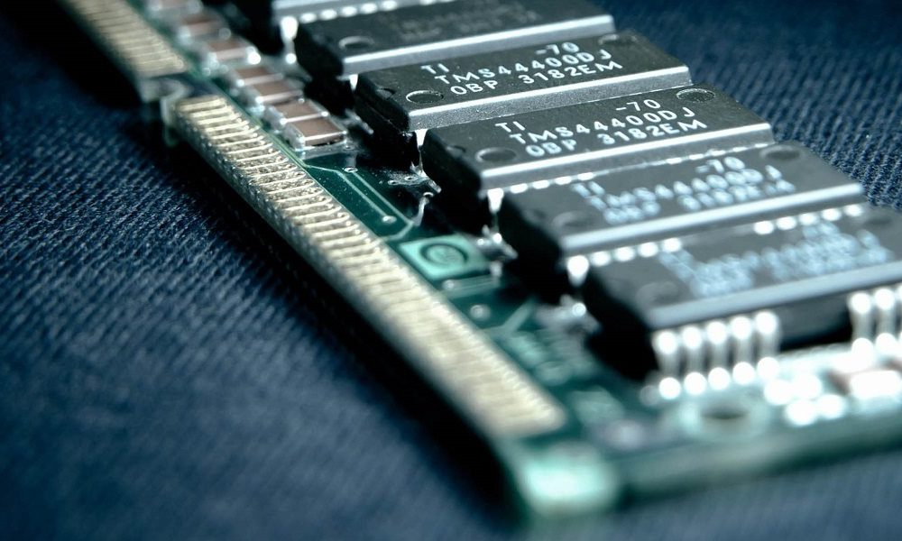

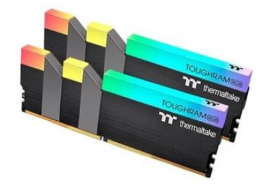

# Estructura módulo memoria RAM

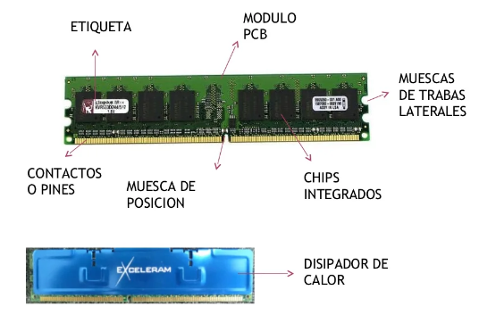

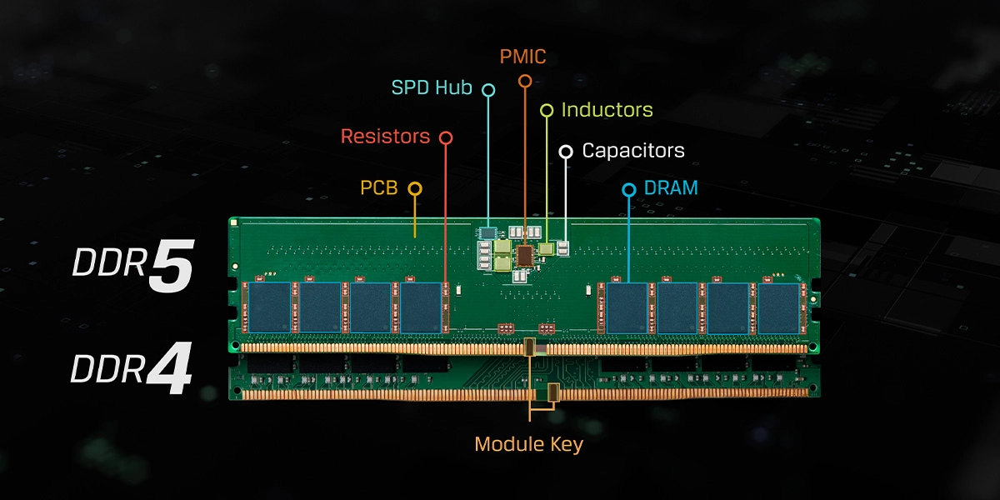

ESTRU
## SPD. Serial Presence Detect chip

**El Circuito SPD (Serial Presence Detect Chip):** Es el encargado de almacenar datos relativos al módulo de memoria RAM, como el tamaño de la memoria, el tiempo de acceso, la velocidad y el tipo de memoria. De esta forma el ordenador conocerá que memoria RAM tiene instalada de manera automática sin intervención del usuario.

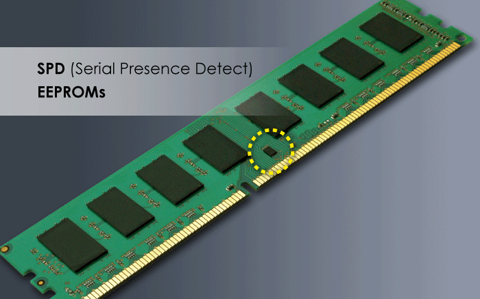

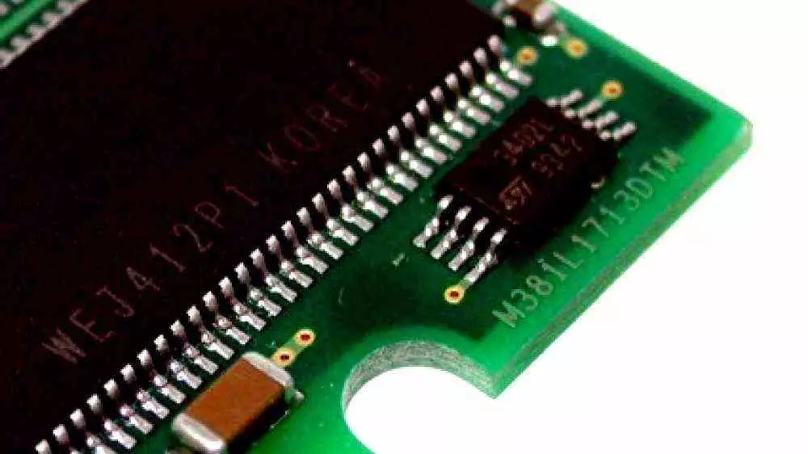

## PMIC - Power management integrated circuits

**PMIC (Power management integrated circuits o Circuitos integrados de gestión de energía)**

* Exclusivo de DDR5
* Chip situado en el centro de las memorias DDR5 y se encarga de gestionar la energía (voltajes) del módulo
* Permite, entre otras cosas, la implementación de una tecnología de sincronización multifásica. Una novedad que permite realizar transmisiones a un voltaje más bajo o más alto si es necesario. Ahora será siempre gestionado desde el propio módulo de memoria DDR5.

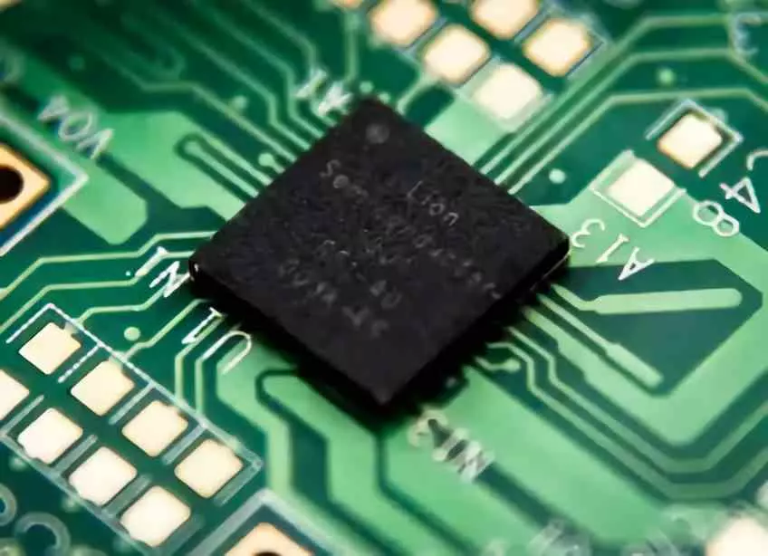

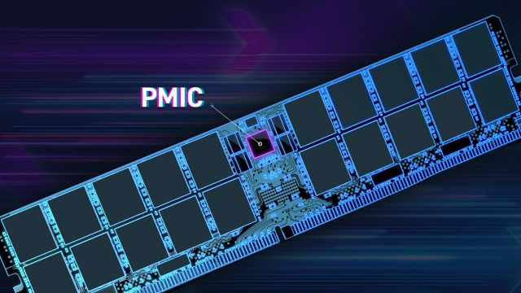

[https://www.crucial.es/articles/about-memory/how-is-memory-made](https://www.crucial.es/articles/about-memory/how-is-memory-made)

# Comunicación memoria-procesador → IMC

**IMC (Integrated Memory Controller)**.  Es el circuito digital situado en el procesador que controla el flujo de datos entre el procesador y la memoria RAM.
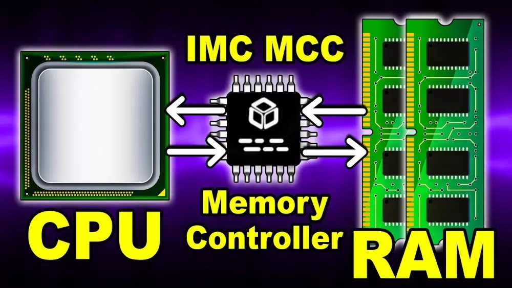

Los controladores de memoria contienen la lógica necesaria para leer y escribir en la memoria RAM

* Hasta DDR4 la comunicacción entre el procesador y la memoria es a traves de un bus de 64 bits
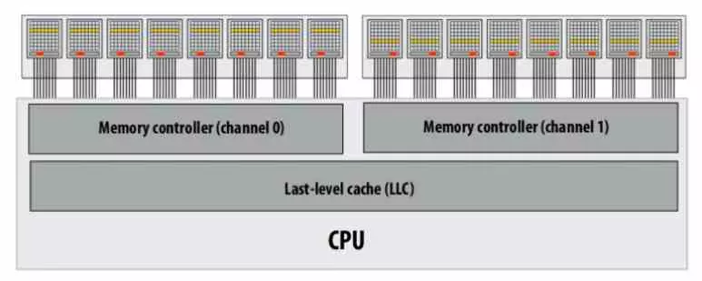
  
* En DDR5 la comunicacción entre el procesador y la memoria es a traves de un bus de 2x32 bits.

  

# Single Channel vs Dual Channel

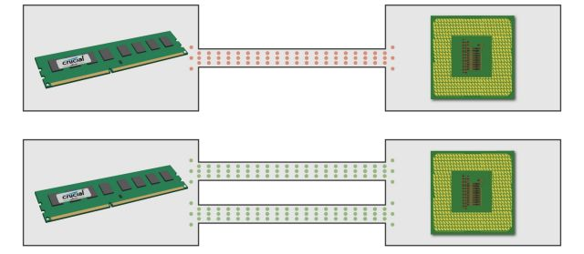

**Single Channel** describe cualquier configuración en la que la CPU solo tiene acceso a un solo bus de 64 bits de ancho en DDR4 o 2x32 en DDR5 para acceder a la memoria.

La tecnología **Dual-Channel** o doble canal es una tecnología que aumenta el rendimiento porque se permite el paso simultáneo a los 2 módulos de memoria RAM duplicando (teóricamente*) el ancho de banda entre la memoria y la CPU pero que en la práctica no pasa de un 20 a 45%.

Para disponer de Dual-Channel, la placa base lo debe soportar. Además hay que instalar 2 módulos de memoria idénticos: mismos timings, capacidad, etc.

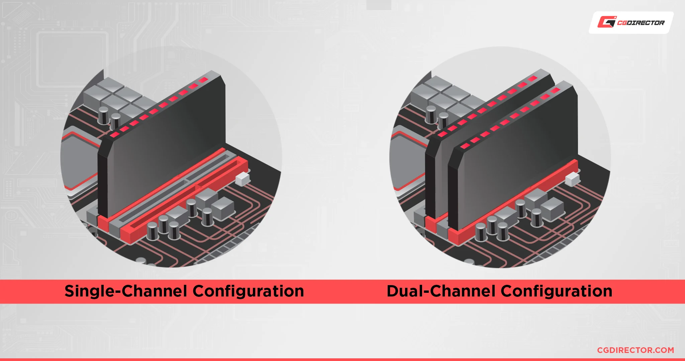
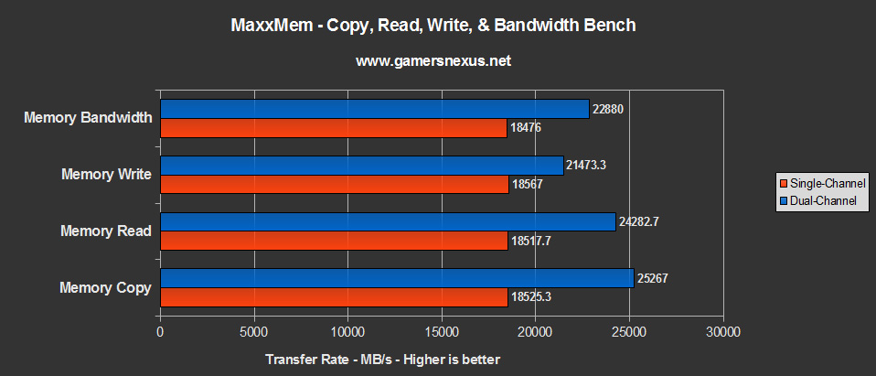
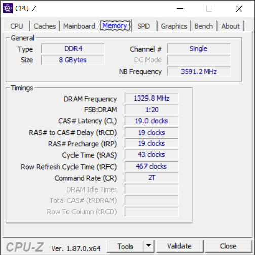
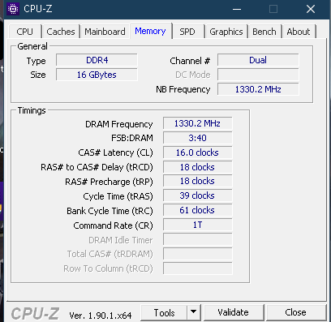

# Características de la memoria RAM
## Capacidad

La  capacidad hace referencia a la cantidad de datos que se pueden almacenar en la RAM. La memoria RAM es un almacén de datos y lógicamente una característica importante es cuántos datos puede almacenar. 

Los transistores del interior de los bancos de memoria tienen un determinado tamaño, con lo cual a menor tamaño de transistor mayor densidad de celdas lo que implica más capacidad.

Esta capacidad se mide actualmente en los módulos DDR en **GB (GigaBytes)**.

La cantidad de memoria estará directamente relacionada con el uso que hagas del equipo. Cada uso requiere una cantidad de RAM diferente. No se necesita la misma memoria RAM para navegar, que para jugar o editar vídeo o fotos.

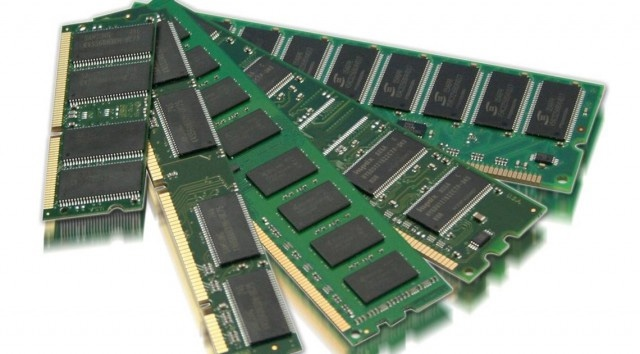

## Velocidad o frecuencia de reloj

* Los chips de memoria integrados en cada módulo de memoria funcionan a una frecuencia de trabajo determinada.
* Este valor se mide en MHz, por lo tanto, a mayor cantidad de Megahercios, mayor velocidad tendrá el módulo.
* En las memorias de tipo DDR (DOUBLE data rate) se realizan 2 operaciones por cada ciclo de reloj  y no una como en las SDR, por tanto  los 3200 MHz anunciados serían en realidad 3200 MT/s (millones de transferencias por segundo) y la frecuencia real sería la mitad, es decir 1600MHz.
* Por ejemplo, 3200 MHz significa que se tardan 1/3200MHz = 0,3125 nanosegundos por cada ciclo de reloj.
* Al elegir la memoria RAM, hay que asegurarse de que la placa base soporta la frecuencia de trabajo de la memoria RAM.
* Al instalar algunos módulos de memoria, la placa puede configurarlos para que trabajen a una frecuencia inferior a la que el fabricante prometía. En ese caso se tendrá que configurar la frecuencia de la memoria RAM manualmente desde la BIOS o UEFI para subir el multiplicador de sus frecuencias y hacer que funcionen a la velocidad correcta.

* SDR vs DDR

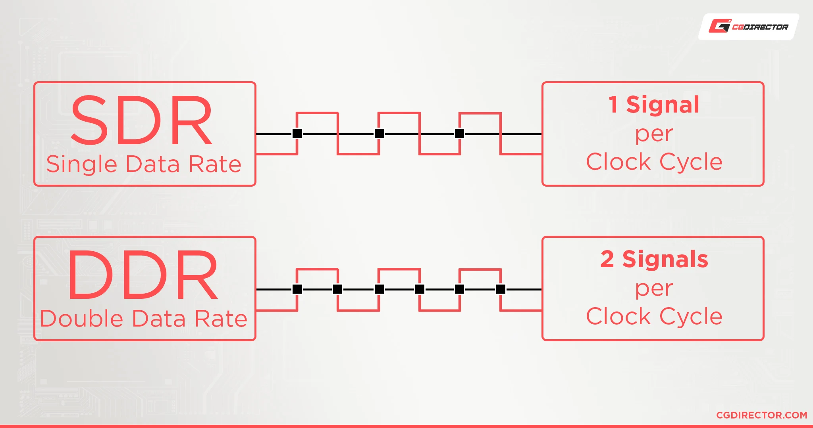

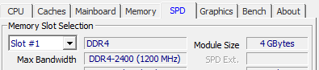

## Tasa de transferencia de datos

La **tasa de transferencia de datos** se refiere a cuántos bytes puede transferir un módulo en un tiempo concreto.

Por ejempo: Crucial DDR4 2400 PC4-19200 4GB →

Tasa de transferencia de datos= 2400Hz*8B = 19200 MB/s

## Ancho de banda

El **ancho de banda máximo de memoria** o **BW (BandWidth)** es la velocidad máxima a la cual el procesador puede leer o almacenar datos en una memoria. Actualmente se mide en GB/s.

## Latencia

La estructura interna de la memoria RAM es como la de un tablero de ajedrez tridimensional en el que cada cuadro del tablero es una celda en la que se escriben los datos que se almacenan.

La latencia es el tiempo que tarda la memoria RAM en situarse en una determinada celda para leer o escribir su contenido. Cuanto mayor sea la latencia de la memoria RAM, mayor es el tiempo que “pierde” en llegar a una determinada celda y, por lo tanto, menos eficiente en su trabajo.

Por lo tanto, a igualdad de frecuencias de reloj para un módulo de memoria RAM, es preferible elegir una memoria RAM con una latencia baja.

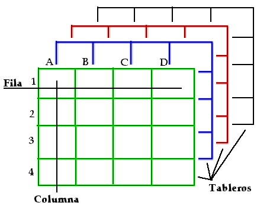

_[https://pcpro.es/guias/latencia-memoria-ram-que-es-y-tipos/](https://pcpro.es/guias/latencia-memoria-ram-que-es-y-tipos/)_

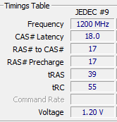

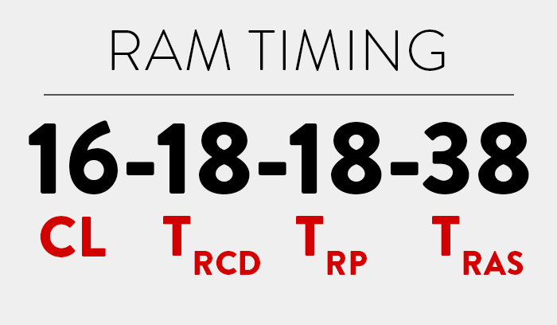

**Timings.**  Suelen visualizarse en formato numérico: 9-9-9-24 es un ejemplo de tiempos o timings de una memoria DDR.

## Voltaje

El voltaje es el valor de tensión a la que el módulo de memoria RAM trabaja.

Disminuye a la vez que la tecnología avanza, es decir el consumo de los módulos DDR5 es inferior al de los módulos DDR4.

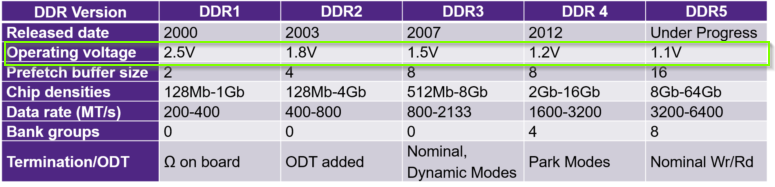

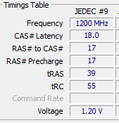

## Tipos de memoria RAM DDR

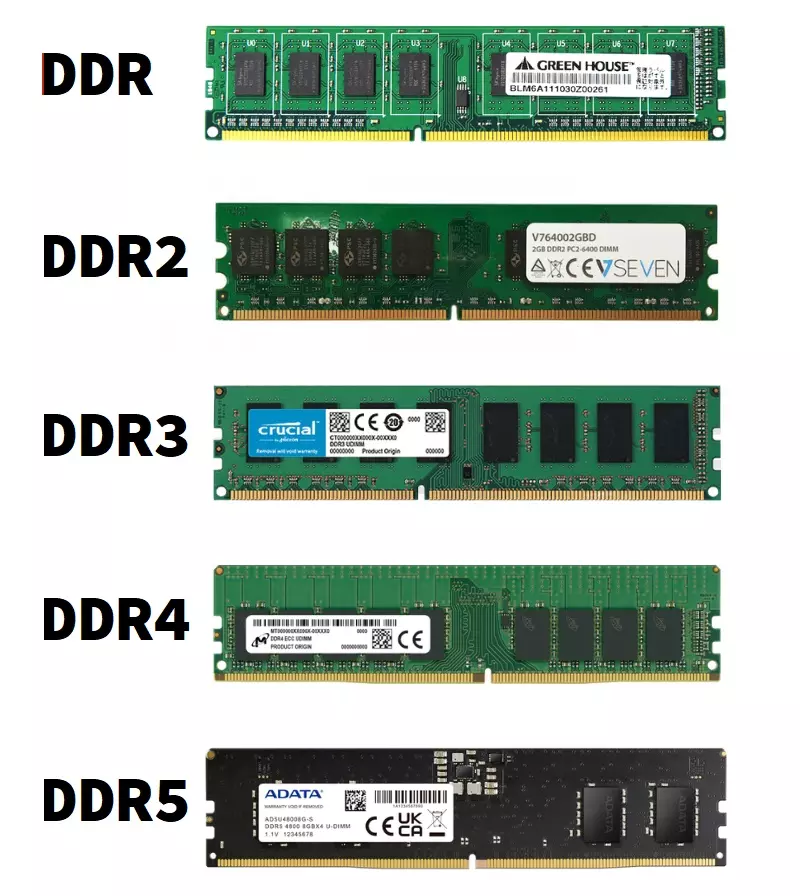

## Factor de forma

* **DIMM:** El término  style="color:#333333"> DIMM  style="color:#333333"> es el acrónimo de la expresión “Dual In-line Memory Module”
* **SO-DIMM:** “Small Outline Dual In-line Memory Module”, y es precisamente esas palabras «Small Outline» lo que las diferencia de los módulos DIMM habituales. La diferencia es meramente física, ocupan un menor espacio y así se pueden instalar en equipos de tamaño reducido como los portátiles.

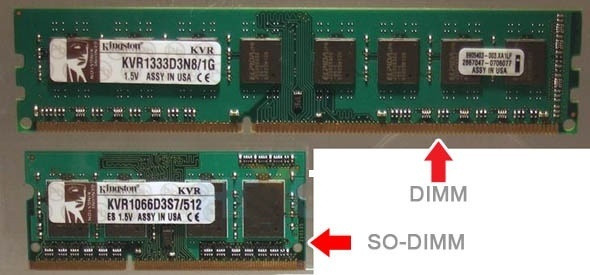

| Tipo | Pines | Longitud |
| :-: | :-: | :-: |
| SO-DIMM DDR | 200 | 67.6 mm |
| SO-DIMM DDR2 | 200 | 67.6 mm |
| SO-DIMM DDR3 | 204 | 67.6 mm |
| SO-DIMM DDR4 | 260 | 69.6 mm |
| SO-DIMM DDR5 | 262 |  |

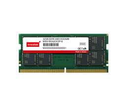

[Detalle de la muesca](https://upload.wikimedia.org/wikipedia/commons/9/95/Laptop_SODIMM_DDR_Memory_Comparison_V2.svg)

## Perfiles

* La memoria está preparada para trabajar a diferentes frecuencias y diferentes latencias. Cada configuración de frecuencias, latencias y voltaje se conoce como perfil, y el fabricante asegura que el rendimiento es óptimo con esos perfiles. Estos perfiles se almacenan en el circuito SPD de la memoria.
* Existen dos tipos de perfiles, dentro de cada tipo, el fabricante puede configurar diferentes variantes.
* Perfiles JEDEC: son configuraciones aprobadas por el organismo encargado de la estandarización de la memoria RAM. Estas configuraciones son muy seguras pero no aprovechan las altas frecuencias de las memorias RAM actuales. Suelen venir indicadas con un número, por ejemplo, JEDEC #4, JEDEC #5, etc.
* Perfiles XMP (Intel eXtreme Memory Profile) o DOCP/EXPO (AMD): son configuraciones aprobadas por Intel  y AMD  para conseguir obtener frecuencias de funcionamiento de la memoria superiores a las aprobadas por JEDEC. Suelen venir indicadas con un número, por ejemplo, XMP-3200, XMP-4000, etc.
  * _[https://www.asus.com/latin/support/FAQ/1042256/](https://www.asus.com/latin/support/FAQ/1042256/)_
* Por defecto la placa base sólo funciona con perfiles JEDEC, detectando automáticamente el perfil que mejor rendimiento tenga. Si la placa base está preparada para admitir perfiles XMP o  DOCP/EXPO , estos se podrán configurar desde la BIOS/ UEFI .

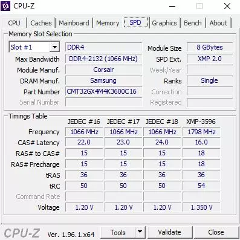

# Identificación de RAM

_[https://www.kingston.com/spain/es/memory/memory-part-number-decoder](https://www.kingston.com/spain/es/memory/memory-part-number-decoder)_   

## Etiquetas

 KVR32N22D8/16 (  _[http://www.kingston.com/dataSheets/KVR32N22D8_16.pdf](http://www.kingston.com/dataSheets/KVR32N22D8_16.pdf)_   )

KVR. Corresponde a las iniciales del fabricante (Kingston)

32. Corresponde a la velocidad efectiva en MHz (3200MHz)

N. NonECC (No corrige errores). Si fuera E (ECC) corrige errores.

22. Latencia (CAS).

D. Dual Channel. Si fuera S (Single), Q(Quad)

8. Número de chips de memoria.

16. Capacidad del módulo (16GB)

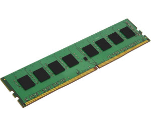

 KVR16N11K2/16 (  _[http://www.kingston.com/dataSheets/KVR16N11K2_16.pdf](http://www.kingston.com/dataSheets/KVR16N11K2_16.pdf)_   )

KVR. Corresponde a las iniciales del fabricante (Kingston)

16. Corresponde a la velocidad efectiva en MHz (1600MHz)

N. NonECC (No corrige errores). Si fuera E (ECC) corrige errores.

11. Latencia (CAS).

K2. Kit de 2 piezas

16. Capacidad del módulo (16GB)

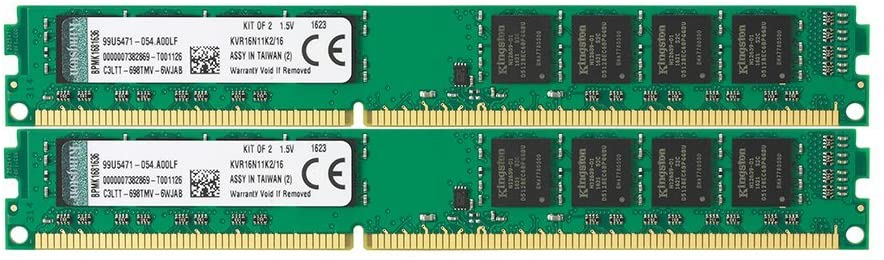

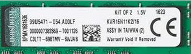

 KVR26S19S8/16 (  _[http://www.kingston.com/dataSheets/KVR26S19S8_16.pdf](http://www.kingston.com/dataSheets/KVR26S19S8_16.pdf)_   )

KVR. Corresponde a las iniciales del fabricante (Kingston)

26. Corresponde a la velocidad efectiva en MHz (2600MHz)

S. Tipo de módulo SODIMM

19. Latencia (CAS).

S. SODIMM

8. Número de chips de memoria.

16. Capacidad del módulo (16GB)

CT32G4S266M (  _[https://www.crucial.es/memory/ddr4/ct32g4s266m](https://www.crucial.es/memory/ddr4/ct32g4s266m)_   )

CT. Crucial

32G. Capacidad del módulo (32GB)

S. SODIMM

266. Velocidad efectiva (2666MHz)

M. compatible con MAC

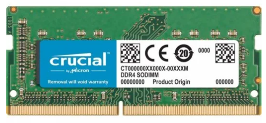

 CT32G4DFD8266 (  _[https://www.crucial.es/memory/ddr4/ct32g4dfd8266](https://www.crucial.es/memory/ddr4/ct32g4dfd8266)_   )

CT. Crucial

32G. Capacidad del módulo (32GB)

4DF

D8. Dual Channel

266. Velocidad efectiva (2666MHz)

 CMK64GX4M4B3600C18 (  _[https://www.corsair.com/es/es/Categor%C3%ADas/Productos/Memoria/VENGEANCELPX/p/CMK64GX4M4B3600C18#tab-tech-specs](https://www.corsair.com/es/es/Categor%C3%ADas/Productos/Memoria/VENGEANCELPX/p/CMK64GX4M4B3600C18#tab-tech-specs)_   )

CMK. Corsair

64GX4M4. Kit de 64 GB (4x16GB cada uno)

3600. Corresponde a la velocidad efectiva en MHz (3600MHz)

18. Latencia (CAS).

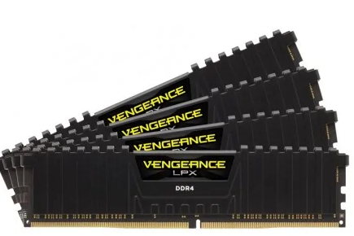

# ¿Cómo saber qué memoria tengo instalada?

¿Cómo saber qué memoria tengo instalada? Podemos usar software de terceros o acceder al símbolo de sistema (Windows+r→cmd→y ejecutar “wmic memorychip”

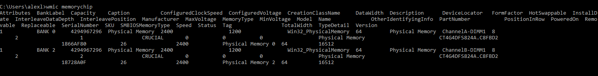

# VRAM

Video Ram o memoria de vídeo está presente en todas las tarjetas gráficas, es un tipo de memoria diseñada especialmente para llevar a cabo un tipo concreto de tareas en aplicaciones gráficas y videojuegos.

GDDR SDRAM, es el tipo de RAM de gráficos más popular, y es lo que encontrará en la gran mayoría de las GPUs actuales. La abreviatura significa Graphics Double Data Rate Synchronous Dynamic Random-Access Memory

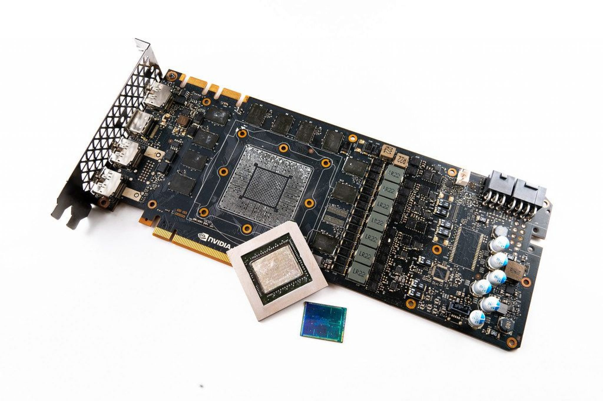

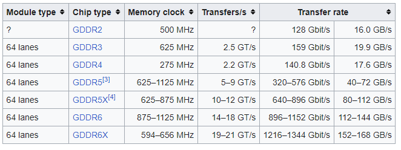

# Dispositivos de almacenamiento

# Definición

Los dispositivos de almacenamiento de un equipo microinformático, también conocidos como memoria secundaria, es el lugar donde se almacenan permanentemente los programas y datos con los que se trabaja en el mismo. Se caracteriza por tener gran capacidad de almacenamiento, ser no volátil y por un tiempo de acceso más lento que el acceso a la memoria principal.

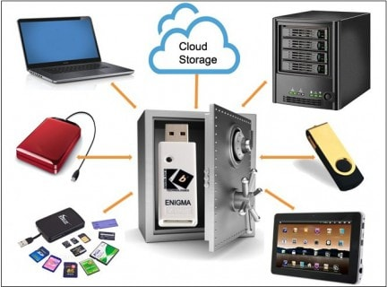

# Unidad de almacenamiento principal

Actualmete los dispositivos de almacenamiento secundario principal en un equipo microinformático y donde se suele instalar el sistema operativo, además de tener la posibilidad de almacenar programas y datos son los **discos duros magnéticos o HDD (Hard Disk Drive)** y las **unidades de estado sólido o SDD (Solid State Drive)**

Sus características principales son:

* Gran capacidad de almacenamiento.
* No volátil.
* Acceso más lento que la memoria principal(RAM).

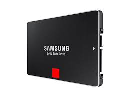 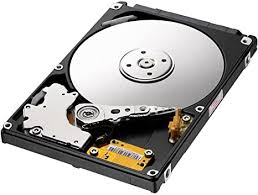 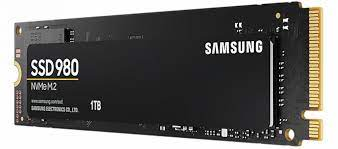

## Disco duro magnético. Estructura mecánica

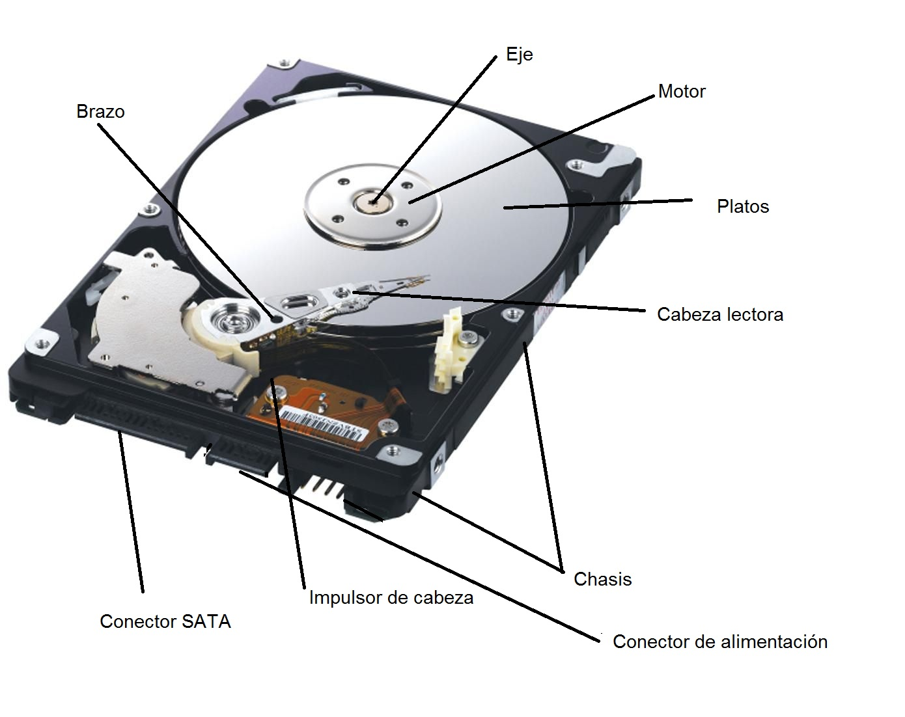

* Un disco duro magnético está formado por uno o varios **discos** (o <strong>platos</strong>), normalmente de aluminio, que en su superficie se almacena la información ya que están recubiertos con un material <strong>magnetizable</strong>.
* Estos platos están fijados en el centro a un eje donde hay un **motor de rotación** cuya misión es hacerlos girar al unísono a gran velocidad (<strong>rpm</strong>).
* Sobre los discos existen unos **brazos** encargados de moverse sobre toda la superficie del disco gracias a otro motor diferente.
* En los extremos de estos brazos se instalan las **cabezas (heads)** que son las que realizan las funciones de \*\*lectura y escritura\*\*.
* Las cabezas se mueven a través de la superficie de los platos por la acción del <strong>impulsor de cabeza</strong>.
* La **controladora** es una placa electrónica encargada de sincronizar todas las acciones para conseguir la lectura/escritura, y comunicarse con el resto del sistema a través del <strong>interfaz</strong>.
* <strong>Caché</strong>. Las unidades actuales tienen un chip de memoria integrada en el circuito electrónico. Éste hace las veces de puente de intercambio de información desde los platos físicos hasta la memoria RAM.  Es como un búfer dinámico para aligerar el acceso a la información física y suele ser de 64 MB.
* Todos los elementos anteriores se aglutinan en una <strong>caja sellada</strong>, para evitar la entrada de polvo y suciedad

### Disco o platos magnetizables

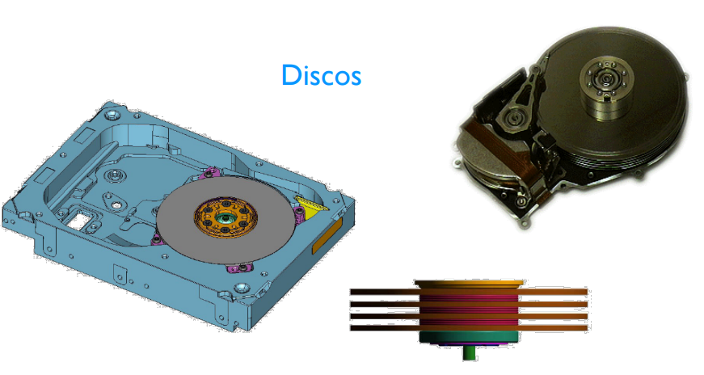

### Brazos

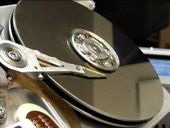

### Motor

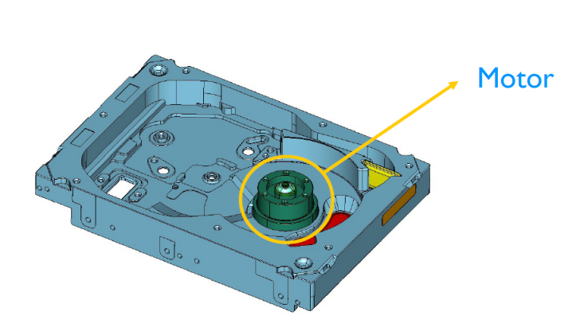

El motor gira a una determinadas **RPM: revoluciones por minuto**

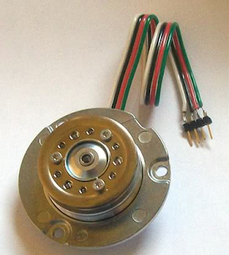

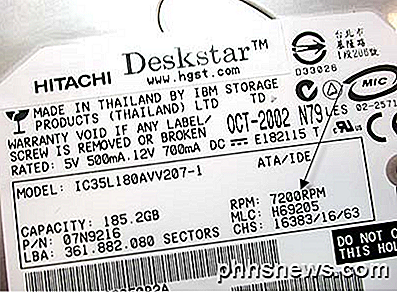

### Cabezas

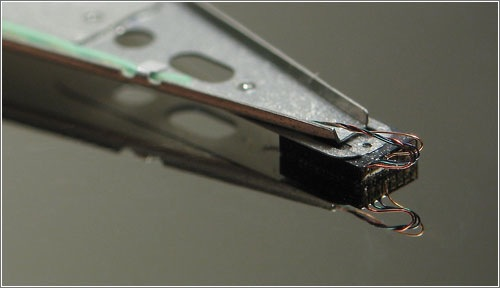

### Cabezas lecto/escritoras

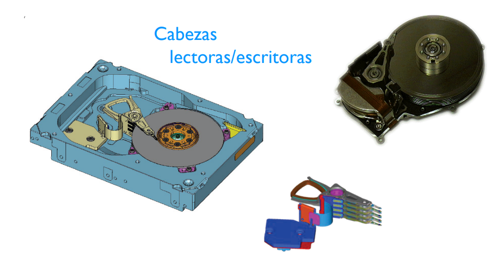

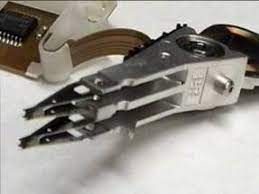

### Controladora de disco

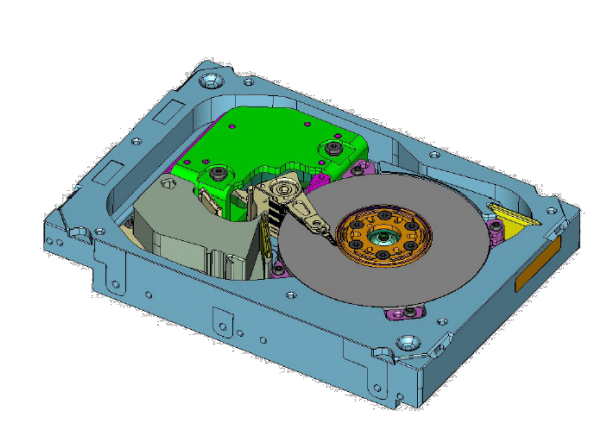

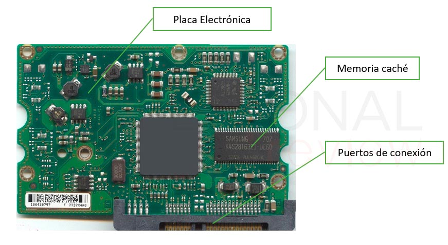

# SSD.

**SSD (Solid State Drive - Unidad de Estado Sólido)** utilizan memorias de tipo **flash NAND**.

**Ventajas:**

* Velocidad o Tasa de transferencia de datos. Tanto en la búsqueda de los datos como en las lecturas posteriores. En una unidad de este tipo el tiempo que tienes que esperar hasta obtener los datos es siempre el mismo (similar a la RAM). 
* Mayor resistencia a golpes. Al no tener componentes móviles responden mejor tanto a las vibraciones como a los golpes.
* Menor consumo de energía. Necesitan menos potencia para funcionar al no disponer de partes móviles
* Menor ruido. Otra ventaja más de no tener partes móviles.
* No tiene fragmentación.

**Inconvenientes:**

* Precio por bit mayor.
* Menor capacidad.
* Sus celdas pueden reescribirse un número limitado de veces.


## Estructura interna

* **Controlador (Controller)**: El controlador es el cerebro de la unidad SSD. Se encarga de gestionar las operaciones de lectura y escritura, así como de llevar a cabo la administración de la memoria. Además, controla la interfaz de conexión con la placa madre, que suele ser SATA, PCIe o NVMe.
* **Chips de memoria NAND Flash:** La memoria NAND Flash es el componente fundamental de almacenamiento en una SSD. Está compuesta por celdas de memoria que retienen los datos de forma no volátil. Hay varios tipos de memoria NAND.
* **Cache DRAM** : Algunas SSDs incorporan una memoria caché DRAM (memoria de acceso aleatorio dinámica) para mejorar el rendimiento. Esta memoria se utiliza para almacenar temporalmente datos que se acceden con frecuencia, acelerando las operaciones de lectura y escritura.
* **Conector:** Las SSDs se conectan a la placa madre a través de un conector que puede ser SATA (o mSATA), NVMe o incluso PCI-E, dependiendo del modelo y la interfaz de conexión utilizada.
* **Firmware:** El firmware es el software interno que reside en la SSD y es gestionado por el controlador. Este software controla las operaciones, la gestión de errores y las funciones avanzadas de la unidad SSD.


## Tipos de conexión


## Chips de memoria NAND FLASH

Los chips de estas memorias basan su estructura en transistores de puerta flotante (floating gate). La diferencia entre este tipo de transistores y los que usan la memoria DRAM, es que estos últimos deben tener una carga eléctrica con una frecuencia de refresco constante para mantener los datos almacenados. Este es el motivo por el que la memoria RAM de nuestro ordenador se vacía al apagar el ordenador.

La memoria NAND está diseñada para mantener su estado de carga aun cuando no está recibiendo corriente eléctrica, con lo que se consigue mantener la información. Por lo tanto, es un tipo de memoria no volátil

Los electrones son almacenados en el puente flotante (Flaoting Gate), de forma que toma una lectura de 0 cuando está cargado, o 1 si está vacío. Son unos valores opuestos a lo que se suelen utilizar. De ahí el nombre Negated AND


Los transistores que componen la memoria almacenan la información en  celdas  en las que se almacenan datos en forma de voltajes. Dichas celdas forman matrices o bloques de las que a cada fila se le conoce como  página ;


# Características generales de las unidades de almacenamiento

* Interfaz. ( Conexión al PC o dispositivo ). Podemos encontrar discos duros con la interfaz IDE, SATA, SCSI, SAS o SATA Express, pero también interfaces de conexión externos como USB, Thunderbolt, Firewire o eSATA.
* Factor de forma: El factor de forma nos da las dimensiones del disco duro. Se mide en pulgadas, las cuales indican el diámetro de los platos (en el caso de que lleven). Podemos encontrar los siguientes factores de forma
    * 3,5" pulgadas o LFF
    * 2,5" pulgadas o SFF
    * M.2
    * U.2
    * U.3
* Capacidad de almacenamiento. Se mide GB o TB
* Memoria caché. La memoria caché del disco duro almacenará la información más solicitada, de manera que la controladora pueda acceder a ella de manera más rápida sin tener que ir a leerla internamente. Esta memoria se mide en Megabytes.
* Tiempo de acceso. El tiempo de acceso es el tiempo medio que tarda el disco duro en estar preparado para transferir datos (ya sea de lectura o de escritura). Este tiempo se mide en nanosegundos (ns)
* Velocidad de rotación del motor de los discos duros magnéticos. Marca la velocidad de giro en los discos duros magnéticos. Los discos con interfaz IDE y SATA giran a 5.400 o 7.200 rpm (revoluciones por minuto). En los discos duros con interfaz SCSI o SAS las velocidades de giro son mayores, de 10.000 e incluso 15.000 rpm, aunque son ruidosos y consumen más energía.
* Velocidad lectura/escritura \_\_en discos SSD. Velocidad a la que el disco es capaz de leer y escribir información. 
* Temperatura. Indica el rango de temperaturas a las que el disco puede funcionar.
* Nivel sonoro: Nos indica el nivel de ruido que emitirá el disco duro en funcionamiento. Se mide en decibelios (dB).
* Resistencia a golpes: Mediría el golpe máximo que el disco duro es capaz de soportar sin romperse. Se utiliza la medida de fuerza (G), donde 1G es la fuerza de la gravedad cuando estás parado, sentado o acostado.
* Vida útil - Terabytes Written (TBW ). Se define por el JEDEC como el número de terabytes que pueden ser escritos en un SSD hasta que sus células de memoria se «agoten»
* Tiempo medio entre fallos - Mean Time Between Failures (MTBF) \_\_en discos SSD.
* Humedad. Indica el rango de humedad a las que el disco puede funcionar.
* Altitud. Indica el rango de altitud a las que el disco puede funcionar.

# Interfaces de dispositivos de almacenamiento

## **IDE (Integrated Drive Electronics)

Ha sido la interfaz más utilizada hasta hace pocos años para la conexión de dispositivos de almacenamiento en los equipos microinformáticos. Aunque actualmente no se fabrican dispositivos para esta interfaz, es muy común encontrarnos equipos antiguos que la utilicen.


Cada conector IDE de la placa base admite como máximo dos dispositivos IDE, como por ejemplo dos discos duros, o un disco y una unidad de DVD-ROM o CD. Uno se identificará como maestro (master) y otro como esclavo (slave). Para configurar un dispositivo IDE como maestro y esclavo se utilizan jumpers (o puentes) que se sitúan en la parte posterior del disco.

La conexión de datos del dispositivo IDE a la placa base se hará mediante un cable plano que posee conectores de 40 pines

Para suministrar energía al dispositivo se utiliza el conector Molex que parte directamente de la fuente de alimentación.


## Interfaz SATA

El interfaz SATA (Serial Advanced Technology Attachment), es el sustituto de IDE para conectar dispositivos de almacenamiento en los equipos microinformáticos (Discos duros/Unidades ópticas)

**Estándares:**


La velocidad de transferencia efectiva sólo tiene en cuenta los datos finales del usuario, mientras que la velocidad de transferencia en bruto cuenta también los bits de control del interfaz (bit de arranque y bit de parada).

Los cables de datos solo poseen dos conectores, uno en cada extremo, por lo que sólo se podrá conectar un dispositivo SATA a cada uno de los conectores de la placa base. Por tanto, el concepto de maestro y esclavo desaparece en esta interfaz. El conector de datos tiene un ancho de 1 mm y está compuesto de 7 hilos.

Conector de alimentación SATA directo desde la fuente.


## Interfaz NVMe - M.2

**NVMe** son las siglas de «Non-Volatile Memory Express», o memoria exprés no volátil.

Utiliza la tecnología PCI-Express lo que le permite al disco duro ofrecer un ancho de banda mucho más amplio en *[comparación con la interfaz SATA.](https://www.geeknetic.es/Guia/2189/SSD-M2-NVMe-y-SATA-Caracteristicas-y-Diferencias.html)*


¿Qué diferencias de velocidades hay entre SSD PCIe 3.0 vs 4.0 vs 5.0?

* Alrededor de 3500 MB/s de lectura/escritura en SSD PCIe 3.0 NVMe.
* En torno a los 7000 MB/s de lectura/escritura en SSD PCIe 4.0 NVMe.
* Unos 12.000 MB/s de lectura/escritura en SSD PCIe 5.0.

## Interfaz SCSI


La interfaz SCSI (Small Computers System Interface - Interfaz de Sistema para Pequeñas Computadoras). Todo lo contrario a lo que su nombre indica, se utilizaba en entorno profesionales.

Los discos duros de esta interfaz son más caros y suelen ser más rápidos a la hora de transmitir datos ya que usan menos el microprocesador para esa tarea.

Actualmente este interfaz está obsoleto, y ha dado paso a su sucesor SAS.

Utiliza el modo de transmisión paralelo y permite la conexión de hasta 16 dispositivos, incluida la controladora.

Las placas bases no solían disponer de conectores SCSI integrados, por lo que se necesitaba una tarjeta de expansión SCSI adicional para poder conectarlos.

## Interfaz SAS

El interfaz SAS (Serial Attached SCSI) es una interfaz de conexión de dispositivos de almacenamiento que ha sido la sucesora del interfaz SCSI. → Servidores

Aumenta la velocidad de transferencia al aumentar el número de dispositivos conectados, hasta 128 dispositivos


Las placas base no suelen tener este tipo de controladoras integradas, necesitando tarjetas de expansión adicionales para poder utilizar este tipo de interfaz.

Similar al conector de la interfaz SATA, pero el conector del disco duro posee una particularidad, el conector de datos y el de alimentación están unidos sin separación entre ellos. Debido a esta particularidad, los discos duros SATA pueden ser utilizados en una controladoras SAS, pero no a la inversa


## Interfaz U.2

la interfaz U.2 permite conectar dispositivos de almacenamiento a través del bus PCIe mediante un conector de factor de forma pequeño (SFF) que también es compatible con discos mecánicos SAS y SATA. Dicho de otra manera, esta interfaz permite utilizar SSD en formatos estándar de 2,5″ pero con interfaz PCI-Express.
La interfaz U.2 hoy en día está completamente en desuso en el ámbito del mercado de consumo pero que se sigue utilizando en el empresarial (Servidores y Data Centers)

## Interfaz U.3

Evolución de U.2

### Interfaces para unidades de almacenamiento externas

USB

Thunderbolt


## Factor de forma


### Factor de forma 3\,5” o LFF

3.5" o 3.5 pulgadas o LFF(Large Form Factor) Se refiere a los discos duros "grandes" usados comúnmente en los ordenadores de sobremesa y servidores.

Discos duros actuales →  Interfaz SATA / SAS

Medidas típicas de 101 x 25,4 x 146 mm.


### Factor de forma 2\,5” o SFF

2.5" o 2.5 pulgadas o SFF(Short Form Factor) Se refiere a los discos duros "grandes" usados comúnmente en los ordenadores de sobremesa y servidores

Suelen tener unas dimensiones de 6,9 x 10 x 9,7 centímetros

Podemos encontrar unidades de 2.5” tanto magnéticos, SSD SATA o SSD U.2

Actualmente → Interfaz SATA.


### NVMe M.2

El formato **NVMe M.2** se ha convertido en el más popular para la construcción de discos SSD de altas prestaciones, pues permite la construcción de modelos muy rápidos, con una alta capacidad y con un tamaño muy reducido.

Se conectan mediante tecnología PCI-Express a la placa base para evitar los cuellos de botella.

Se elimina el conector de la alimentación, pues los M.2 se alimentan directamente desde la ranura PCI Express X4. (Actualmente existe PCI Express V5)

Dentro del formato M.2 existen varios tipos, por ejemplo M.2 2242, M.2 2260 y M.2 2280, esto hace referencia a las dimensiones del dispositivo, en el primer caso son 22 mm de ancho x 42 mm de largo mientras que en el segundo tiene un largo de 60 mm y el último un largo de 80 mm.


# Dispositivos de almacenamiento en red

## NAS
El almacenamiento conectado en red, Network Attached Storage (NAS), es el nombre dado a una tecnología de almacenamiento dedicada a compartir la capacidad de almacenamiento de un computador/ordenador (servidor) con computadoras personales o servidores clientes a través de una red (normalmente TCP/IP), haciendo uso de un sistema operativo optimizado para dar acceso con los protocolos CIFS, NFS, FTP o TFTP.

Suelen tener varios discos y se pueden configurar en *[RAID](https://es.wikipedia.org/wiki/RAID)*

Hay discos duros exclusivos para NAS que tienen más durabilidad, los discos utilizados suelen ser magnéticos de 3,5”


## Cabina de discos. Servidores de almacenamiento


*[https://www1.la.dell.com/ue/es/gen/Empresarial/pvaul_md1000/pd.aspx?refid=pvaul_md1000&s=gen](https://www1.la.dell.com/ue/es/gen/Empresarial/pvaul_md1000/pd.aspx?refid=pvaul_md1000&s=gen)*

# RAID

Un RAID es un grupo de discos duros independientes configurados para funcionar como uno solo, ya sea sumando su espacio total, mejorando la velocidad de lectura y escritura o configurados para duplicar la información para estar seguros de que, en caso de que uno de los discos duros se rompa, no vamos a perder los datos.

Existen varios tipo de RAID


## RAID 0

En esta configuración todos los discos duros funcionan como un único volumen, y su espacio total es la suma del espacio de todos los discos duros.

Doble velocidad de lectura y escritura.

No hay paridad de datos ni volumen de respaldo.


## RAID 1

Es uno de los tipos de RAID más utilizados para quienes buscan duplicidad de los datos para estar seguros de que los datos nunca se pierden. En este tipo de RAID, los datos se duplican en los discos duros como si fuese un espejo.

Mayor velocidad de lectura. Sin mejora en la velocidad de escritura.

Un disco duro espejo. Si falla uno de los discos duros se puede reemplazar sin perder datos.

Perdemos el 50% del espacio total de los discos. El espacio total de un RAID 1 es la mitad del espacio total de los discos duros. Por ejemplo, si hacemos un RAID 1 con dos discos duros de 4 TB solo tendremos un espacio total de 4 TB.


## RAID 5

La información se distribuye a lo largo de todos los discos duros, aunque se reserva dicho espacio (el tamaño de una de las unidades) para paridad. Esta paridad, además, se reparte entre todos los discos duros.

Si fallan dos discos se pierde absolutamente toda la información del RAID.

La mejora de velocidad de lectura es también X-1 veces el número de discos usados.

El espacio total de los discos es X-1, El espacio total de un RAID 5 es el espacio de todos los discos duros menos 1, es decir, si vamos a usar 4 discos duros de 4 TB el espacio total será de 12 TB.

Si falla uno de los discos duros, cualquiera de ellos, se puede reemplazar y recuperar todos los datos.


## RAID 6

Prácticamente igual que el RAID 5, pero añade un segundo nivel de paridad, lo que nos permite que fallen hasta dos discos duros del RAID y poder sustituirlos. Si fallan 3, entonces toda la información del RAID se pierde.

El espacio total de los discos es X-2, igual que la mejora de la velocidad de lectura. A cambio de esta doble paridad incluida en el RAID 6 se pierde el espacio total de dos de los discos duros. Por ejemplo, en una configuración de 4 discos duros de 4 TB, el espacio total que tendríamos es de 8 TB, con el doble de velocidad de lectura.


# Almacenamiento en la nube

Un sistema de almacenamiento en la nube o Cloud Storage es un modelo de almacenamiento de datos basado en redes de ordenadores donde nuestros datos están alojados en espacios de almacenamiento virtualizados. Por lo tanto, el espacio no se encuentra en el propio equipo físico del usuario, sino en uno o varios servidores ofrecidos por la compañía que contratemos el servicio.

## Ventajas 

### Rentabilidad

Con el almacenamiento en la nube, no hay que comprar hardware, ni aprovisionar almacenamiento, ni utilizar capital adicional para los picos de la empresa. Puede agregar o eliminar capacidad de almacenamiento bajo demanda, cambiar rápidamente las características de rendimiento y retención, y pagar solo por el almacenamiento que realmente utiliza. A medida que se accede a los datos con poca frecuencia y en contadas ocasiones, puede incluso trasladarlos automáticamente a un almacenamiento de menor costo, con lo que se consigue un ahorro de costos aún mayor. Al trasladar las cargas de trabajo de almacenamiento de las instalaciones a la nube, puede reducir el costo total de propiedad al eliminar el exceso de aprovisionamiento y el costo de mantenimiento de la infraestructura de almacenamiento.

### Mayor agilidad

Con el almacenamiento en la nube, los recursos están a un solo clic. Se reduce el tiempo para poner esos recursos a disposición de su organización de semanas a solo minutos. Esto se traduce en un aumento espectacular de la agilidad de su organización. El personal se libera en gran medida de las tareas de adquisición, instalación, administración y mantenimiento. Y como el almacenamiento en la nube se integra con una amplia gama de herramientas de análisis, su personal puede ahora extraer más información de sus datos para impulsar la innovación.

### Despliegue más rápido

Cuando los equipos de desarrollo están listos para comenzar, la infraestructura nunca debería ralentizarlos. Los servicios de almacenamiento en la nube permiten al Departamento de TI suministrar rápidamente la cantidad exacta de almacenamiento que se necesita, cuando y donde sea necesario. Los desarrolladores pueden centrarse en resolver problemas complejos de las aplicaciones en vez de tener que administrar los sistemas de almacenamiento.

### Administración eficiente de los datos

Al utilizar políticas de administración del ciclo de vida del almacenamiento en la nube, puede realizar potentes tareas de administración de la información, incluida la separación por niveles automatizada o el bloqueo de datos para cumplir con los requisitos de conformidad. También puede utilizar el almacenamiento en la nube para crear un almacenamiento multirregional o global para sus equipos distribuidos mediante el uso de herramientas como la replicación. Puede organizar y administrar los datos de manera que admitan casos de uso específicos, creen eficiencias de costos, refuercen la seguridad y cumplan con los requisitos de conformidad.

### Escalabilidad 
El almacenamiento en la nube ofrece una capacidad de almacenamiento casi ilimitada, lo que le permite escalar verticalmente tanto y tan rápido como necesite. Esto elimina las limitaciones de la capacidad de almacenamiento local. Puede escalar o desescalar verticalmente de forma eficaz el almacenamiento en la nube según sea necesario para los análisis, los lagos de datos, copias de seguridad o aplicaciones nativas de la nube. Los usuarios pueden acceder al almacenamiento desde cualquier lugar y en cualquier momento, sin preocuparse de los complejos procesos de asignación de almacenamiento ni de esperar a que haya nuevo hardware

# Memorias Flash

Es una memoria de tipo EEPROM (Electrically-Erasable Programmable Read-Only Memory).

## Características

* Gran resistencia a los golpes.
* Bajo consumo.
* Silencioso, (no contiene partes móviles).
* Pequeño tamaño y ligereza.
* Gran versatilidad (cámaras digitales, teléfonos móviles, etc.)

## Formatos:

* **Secure Digital (SD)**
* **Pendrive (memorias USB)**
* CompactFlash (CF)
* SmartMedia Card (SMC)
* Memory Stick (MS)
* Multimedia Card o MMC.
* xD-Picture Card (xD)


## Memorias Flash SD

Secure Digital (SD)* es un formato de tarjeta de memoria para dispositivos portátiles, cámaras digitales (fotográficas o video), teléfonos móviles, ordenadores portátiles etc..

SD Association - *[https://www.sdcard.org/](https://www.sdcard.org/)* style="color:#333333">

 ### Versiones:


 ### Factor de forma


### Clasificación


Las tarjetas SD también pueden diferenciarse por su clase para grabación de vídeo:


 

# 10.2 Memorias Flash. Pendrive

Unidad de almacenamiento de datos que puedes conectar a ordenadores u otros dispositivos electrónicos, desde móviles hasta televisores o consolas, mediante su conector USB (Clase A o clase C), de ahí que se le conozca también como memoria USB.

Sus capacidades y velocidades de transmisión de datos dependen de cada uno de los modelos, ya que cada fabricante ofrece diferentes tamaños, y con el paso del tiempo las velocidades han ido aumentando.

Aquí, el almacenamiento de cada pendrive lo puedes formatear con diferentes tipos de *[sistema de archivos](https://www.xataka.com/basics/megaguia-formatos-que-sistema-archivos-formatear-usb-disco-duro-uso-que-vas-a-darle)* style="color:#333333">,


Usos:

Llevar documentos o archivos multimedia para leerlos en cualquier ordenador u otro dispositivo

Guardar copias de seguridad.

Crear un USB booteable, que puede servir para reparar tu sistema operativo o para instalar otro sistema operativo en el ordenador

Utilizar el pendrive como llave de seguridad, que sirve para verificar tu identidad en procesos de identificación en dos pasos.


# Unidades ópticas

Las unidades de almacenamiento óptico son aquellas que son capaces de leer y escribir datos por medio de un rayo láser en un soporte óptico, ya que se almacenan por medio de ranuras microscópicas quemadas. La información queda grabada en la superficie de manera física, por lo que solo el calor (puede producir deformaciones en la superficie del disco) y las ralladuras pueden producir la pérdida de los datos, en cambio es inmune a los campos magnéticos y la humedad.

Los discos compactos (CD), discos versátiles digitales (DVD) y discos Blu-ray (BD) son los tipos de medios ópticos más comunes que pueden ser leídos y grabados por estas unidades.


## CD-ROM

* El **CD-ROM (Compact Disc Read-Only Memory)** fue establecido en 1985 por Sony y Philips.
* Actualmente en desuso al menos en los equipos microinformáticos
* Conexiones: IDE-SATA o externos
* Puede albergar 650 (74 minutos de música) o 700 MB de datos (80 minutos de música).


Si un lector indica 24x, significa que puede llegar a leer hasta:

Velocidad = 24 x 150 KB = 3.600 KB/s


## DVD


* Digital Versatile Disc (disco versátil digital)
* 1995→ *DVD Consortium*
* Un DVD puede tener dos capas y dos caras, su capacidad va de 4,7 GB a 17 GB
* Pueden leer y escribir también CDs
* La velocidad de transferencia de datos de una unidad DVD está dada en múltiplos de 1350 KB/s
* Existen los siguientes formatos:
    * DVD-ROM
    * DVD-Vídeo
    * DVD-Audio
    * DVD-R (recordable) / DVD+R
    * DVD-RW (rewritable) / DVD+RW
    * DVD-R DL (dual layer) / DVD+R DL
  


## Blu-Ray

La tecnología Blu-Ray (https://us.blu-raydisc.com/) hace uso de un rayo láser de color azul con una longitud de onda de 405 nanómetros. 

> [¿Por qué es azul?](https://www.adslzone.net/2017/10/30/por-que-laser-blu-ray-azul/)

* Desarrollado por la Blu-ray Disc Association (BDA) (2002)
* La capacidad del Blu-ray es de 25 GB para una capa, 50 GB para doble capa , 100 GB para triple capa y 128 GB para cuádruple capa (BD-XL)

* Los usos principales del Blu-ray son la grabación y, la distribución del vídeo de alta definición, el almacenamiento de datos y la gestión de activos digitales. Por otro lado, uno de los usos más recurrentes son los videojuegos

* La velocidad de transferencia va a venir expresada por un número seguido de una “X”. En este caso la “X” se refiere a una velocidad de 4,5MB/s. Actualmente existen unidades lectoras de BD con una velocidad de 12x.
* Pueden leer y escribir también CD y DVD


## Comparación CD vs DVD vs Blu-Ray

# Cintas magnéticas LTO


Las cintas magnéticas de almacenamiento de datos han sido usadas para el almacenamiento de datos durante los últimos 50 años.

Las cintas magnéticas son un tipo de medio o soporte de almacenamiento de datos que se graba en pistas sobre una banda plástica con un material magnetizado.

Se mantienen como una alternativa a los discos debido a su bajo coste por bit.

Se utilizan para copias de seguridad.

La grabación y lectura se efectúan de forma secuencial, que significa que para encontrar algo que está en medio de la cinta debes “hacerla avanzar” previamente hasta que el cabezal de lectoescritura se posicione sobre el lugar correcto, proceso que puede demorar varios minutos


 **Linear Tape-Open (LTO)** es una tecnología de cinta magnética de almacenamiento de datos, desarrollada originalmente a finales de 1990.


# Comandos disco duro

Info del disco: wmic diskdrive get caption,serialnumber


Espacio libre: fsutil volume diskfree c:


# Unidad 6. Tarjetas de expansión y periféricos.

# Tarjetas de expansión
# Tarjetas gráficas

La tarjeta gráfica, también llamada tarjeta de vídeo, adaptador de pantalla o simplemente GPU (heredado del nombre de su procesador gráfico) es una tarjeta de expansión o un circuito integrado que se encarga de procesar los datos que le envía el procesador del ordenador y transformarlos en información visible y comprensible para el usuario, representándolos en el dispositivo de salida, el monitor.

Tipos:
* Integradas en CPU(iGPU - Integrated GPU): Estas gráficas integradas tienen normalmente una potencia reducida y además necesitan recursos de memoria RAM del sistema.
  * Intel
  * Amd → APU
  * Apple M
* Tarjetas de expansión
  * PCI-Express x16
  * PCI → Obsoleto
  * AGP → Obsoleto

## Componentes tarjetas gráficas


### GPU - Graphics Processing Unit

La GPU, o Unidad de Procesamiento de Gráficos, se encarga de procesar los gráficos que utiliza el sistema de computación, es decir es una unidad de procesamiento gráfico con una alta capacidad de paralelizado, capaz de trabajar y de procesar gráficos, y de convertir información y datos en elementos visibles por el usuario, pero que también de sacar adelante tareas que requieran de la realización de una gran cantidad de operaciones concurrentes en paralelo

Físicamente es un circuito muy complejo que integra varios miles de millones de transistores y varios núcleos que tienen capacidad de procesamiento independiente.

Así como las CPU, están diseñados con pocos núcleos pero altas frecuencias de reloj, las GPU tienden al concepto opuesto, contando con grandes cantidades de núcleos con frecuencias de reloj relativamente bajas.


### Características GPU

**Núcleos**. Cada uno de ellos contribuye al rendimiento en conjunto de la tarjeta gráfica. Cada fabricante utiliza diferentes arquitecturas, y no es un buen dato para comparar modelos de fabricantes distintos.

* Los núcleos en chips AMD se denominan **Stream Processors**
* Los núcleos en chips NVIDIA se denominan **CUDA Cores**


 
  
**Velocidad o frecuencia base de reloj**. Indica la velocidad a la que operan los núcleos de la tarjeta gráfica. Las frecuencias de las tarjetas gráficas son mucho menores que las de los procesadores.

**Frecuencia de Boost**. Aumento por tiempo limitado de la frecuencia base para acelerar el renderizado de la escena. Lo que se traduce en un aumento de la tasa de fotogramas y/o de la calidad de imagen.

### VRAM

La Video Ram o memoria de vídeo está integrada en forma de chips sobre el PCB de la tarjeta gráfica, y que cuenta con su propio bus de datos. Es un tipo de memoria diseñada especialmente para llevar a cabo un tipo concreto de tareas en aplicaciones gráficas y videojuegos.

En la memoria VRAM se cargan las texturas y los modelos que la GPU va a utilizar y procesar para crear la imagen después. Por tanto, es muy importante que nuestra tarjeta gráfica posea suficiente memoria VRAM.

#### Tipo de VRAM
  * GDDR Graphics Double Data Rate, es el tipo de VRAM de gráficos más popular, y es lo que encontrará en la gran mayoría de las GPUs actuales. → **JEDEC**
    * GDDR5
    * GDDR5X
    * GDDR6
    * GDDR6X
  * HBM (High Bandwidth Memory), tipo de memoria gráfica que tiene un ancho de banda mucho mayor que GDDR6X, utilizadas en el ámbito profesional
    * HBM
    * HBM2
    * HBM2E

#### Bus de memoria de la GPU. 

Es el bus que realiza la interconexión entre la memoria VRAM de la gráfica y la GPU.

**El Ancho de bus de memoria (Memory Bus Width)** es el número de bits de datos que pasan por él. El ancho del bus de memoria dictamina cuántos canales distintos tiene el controlador de memorias de la GPU, esto es, la cantidad de chips que pueden procesar datos a la vez. En el caso de las memorias GDDR actuales, estaremos hablando de 32 bits por chip, por lo que una tarjeta gráfica podrá acceder a la vez a la siguiente cantidad de chips.

$Ancho de bus = Numero de chips * 32$

$Número de chips = Ancho del bus / 32$

> [!NOTE]
>  La NVIDIA GT 1030 tiene 64 bits de ancho de bus, la RTX 3080 tiene 320 bits y la RTX 3090 tiene 384 bits de ancho de bus.

En la siguiente imagen vemos el esquema de una RTX 3080


* RTX 3080:
 * 10 chips
 * 32 bits cada chip

 |$\text{Ancho de bus} = 10 * 32bits = 320 bits$|
|-----|

#### Frecuencia/ velocidad de reloj de la memoria.

La frecuencia establece el número de operaciones por ciclo de reloj que la memoroia es capaz de realizar.

> [!NOTE] 
> No confundir la velocidad de la meorias de la VRAM con la frecuencia de la GPU


#### Ancho de banda (BW) de la memoria.

El ancho de banda de la memoria es la cantidad de datos a los que la GPU puede acceder en cada ciclo de reloj y depende directamente de la frecuencia de la memoria (MHZ) o velocidad de la memoria(Gbps) y del ancho de bus. Normalmente se mide en GB/s

$\text{BW vram (bytes)} = \text{Ancho de bus(bits)} * \text{Frecuencia(Mhz)} / 8$

$\text{BW vram (bytes)}= \text{Ancho de bus(bits)} * \text{Velocidad de la memoria(Gbps)} / 8$

* Ejemplo: Una [FX 5900XT](https://technical.city/es/video/GeForce-FX-5900-XT), cuya velocidad de memoria es de 700MHz y cuyo bus de memoria es de 256bits

$\text{BWvram}= 700 MHz*256 bits = 179.200Mbits/s ⇒ 179200 Mbits/s / 8 bytes = 22400 MB/s = 22,4 GB/s$


### Capacidad.

La cantidad de memoria de la tarjeta gráfica viene dada por la capacidad individual de cada uno de sus chips


### VRM - Voltage Regulator Modules - Módulo de regulación de voltaje.

Es un componente electrónico que permite regular, con mayor o menor eficiencia, el voltaje que se suministra en un circuito electrónico y en el caso que nos ocupa a la tarjeta gráfica.


### Alimentación

Cuanto más potente sea una tarjeta gráfica mayor es su consumo eléctrico, y el problema radica en que todas las gráficas que necesitan alimentación adicional consumen más energía de lo que el zócalo PCI-Express es capaz de proporcionar, limitado actualmente en 75 vatios. En otras palabras, cualquier tarjeta gráfica que tenga un consumo mayor de 75W necesitará alimentación adicional, y la manera de proporcionársela es conectándola directamente a la fuente de alimentación mediante los cables PCI-E de 6 y 8 pines.

Cada uno de los conectores de los cables PCIe de la fuente de alimentación es capaz de proporcionar 12,5 vatios adicionales. En otras palabras, un conector PCIe de 6 pines es capaz de entregar hasta 75 vatios, mientras que esto se eleva hasta los 100 vatios en los conectores de 8 pines.


Una tarjeta gráfica que tenga un consumo eléctrico de 150 vatios, necesitaría los 75 que proporciona la placa base y otros 75 a través de la alimentación adicional de la fuente. En este ejemplo, necesitaríamos 75 vatios adicionales, y con un conector de 6 pines sería suficiente. Si la gráfica tuviera un consumo de 225 vatios, necesitaríamos los 75 de la placa y otros 150 adicionales, que podríamos proporcionarle mediante dos conectores de 6 pines, o incluso uno de 6 y otro de 8 para alcanzar los 250 vatios


#### Conector 12VHPWR

Es un nuevo tipo de conector de alimentación utilizado por tarjetas de gama alta de NVIDIA.

Tiene la capacidad de entregar 600W de potencia bajo un voltaje de 12V, es decir, 50 amperios en un pequeño conector. Sus dimensiones son de apenas 0.7cm para los 12 pines que proporcionan energía, a lo que les suma 4 pequeños pines sensoriales que no dan energía. y que llevan la anchura. total a 0.845cm y 1.4cm de largo.

**¿Qué ocurre si no tenemos este comector en nuestra fuente de alimentación?**  Se puede utilizar un adaptador

### TDP vs TGP vs TBP

* **TDP - Thermal Design Power.** En tarjetas gráficas el término TDP se refiere al consumo de energía que tiene la **GPU** de la tarjeta.
* **TGP - Total Graphics Power**. Cantidad máxima de potencia que la fuente de alimentación del sistema debería ser capaz de proveer a la tarjeta gráfica. Es decir se tiene en cuenta el consumo de la GPU, que nos lo daba el TDP,  y se le suma el consumo de todo el sistema de memoria (que es bastante significativo) y el del VRM que alimenta a la gráfica. Se usa en gráficas con chip **Nvidia**.
* **TBP - Total Board Power.** Concepto equivalente a TGP pero para gráficas con chip **AMD**


[Power Consumption: TDP, TBP and TGP for Nvidia and AMD](https://www.igorslab.de/en/performance-tdp-tbp-and-tgp-at-nvidia-and-amd-graphics-cards-demystified-and-calculated-igorslab/)

👉 **Ejemplo especificaciones tarjeta** 

Los fabricantes nos darán las siguientes especificaciones


## Conceptos de imágenes y video digitales

### Píxel, resolución y aspect ratio

* ## Pixel

Acrónimo del inglés **pic**ture **el**ement, es la unidad más pequeña que compone una imagen digital, ya sea esta una fotografía, un fotograma de vídeo o un gráfico.
- Cada pixel tiene un color.
- Miles o millones de píxeles juntos forman una imagen completa.


## Resolución.
Es la cantidad total de píxeles que componen una imagen o pantalla.   Se expresa como **ancho × alto**.

**Ejemplo:**
- **1920 × 1080** (Full HD) significa que la imagen tiene 1,920 píxeles de ancho y 1,080 de alto.

👉 Cuantos más píxeles tenga una imagen, mayor será el nivel de detalle.


> Selección de resolución es un ordenador


> Tabla de resoluciones


## Aspect Ratio (Relación de aspecto)
El **aspect ratio** es la proporción entre el ancho y el alto de una imagen o pantalla.

Se expresa como una relación:

- **16:9** → formato panorámico moderno (TV y YouTube)
- **4:3** → formato antiguo de televisores
- **1:1** → formato cuadrado

👉 No indica calidad ni cantidad de píxeles, solo la forma de la imagen


### Profundidad de color

La **profundidad de color**La profundidad de color o bits por píxel (bpp)  se refiere a la cantidad de bits para representar el color de un píxel en una imagen.


### Frecuencia de actualización.

La frecuencia de actualización o velocidad de refresco es el número de veces por segundo que se dibuja la imagen en la pantalla en un segundo. Se mide en Hercios.


* [https://hardzone.es/tutoriales/rendimiento/fps-ojo-humano/](https://hardzone.es/tutoriales/rendimiento/fps-ojo-humano/)

### Espacio de color

Un espacio de color es un sistema de interpretación del color, es decir, una organización específica de los colores en una imagen o video. Depende del modelo de color en combinación con los dispositivos físicos que permiten las representaciones reproducibles de color, por ejemplo las que se aplican en señales analógicas (televisión a color) o representaciones digitales.
  * **RGB** es un modelo de color basado en la síntesis aditiva, con el que es posible representar un color mediante la mezcla por adición de los tres colores de luz primarios.
    * [sRGB](https://es.wikipedia.org/wiki/Espacio_de_color_sRGB)
    * [Adobe RGB](https://es.wikipedia.org/wiki/Adobe_RGB)
    * [ProPhoto RGB](https://es.wikipedia.org/w/index.php?title=Espacio_de_color_ProPhoto_RGB&action=edit&redlink=1)
  * **CMYK** (siglas de Cyan, Magenta, Yellow y Key) es un modelo de color sustractivo que se utiliza en la impresión en colores.


## Conectores de señales de video

Las tarjetas gráficas disponen de unos conectores de salida que sirven para conectarla con los monitores, algunas de estas tarjetas también pueden emitir audio digital.


### VGA. Video Graphics Array

Sólo puede llevar información analógica de tipo RGBHV (Red, Green, Blue, frecuencia Horizontal, frecuencia Vertical)

Resolución máxima: 2048 x 1536 píxeles a 85 Hz

Conector DB de 15 pines


### DVI (Digital Visual Interface)

Su parte izquierda está destinada a llevar las señales digitales de la tarjeta gráfica al monitor, mientras  que en su lado derecho están los pines destinados a transmitir la señal analógica.

Los tres tipos de conectores DVI que podemos encontrar son:
* DVI-A (analógico)
* DVI-D (digital)
* DVI-I (integrado; analógico y digital).

Además los conectores DVI-I y DVI-D tienen dos velocidades de datos distintas, conocidas como Single-Link (SL) y Dual-Link(DL)
* SL →1.65 Gbps de ancho de banda lo que permite llegar a 1920 x 1200 píxeles a 60Hz
* DL→ 2 Gbps de ancho de banda lo que permite llegar 2560 x 1600 píxeles a  60 Hz


### HDMI (High-Definition Multimedia Interface)

**HDMI** responde a las siglas High Definition Multimedia Interface (interfaz multimedia de alta definición) y hace referencia a la norma de conexión que permite transmitir audio y vídeo digital sin comprimir desde un equipo a otro y con un único cable.


### DisplayPort

**DisplayPort** es una interfaz digital para todo tipo de dispositivos, la cual ha sido desarrollada por VESA, por lo que estamos ante una interfaz que está **libre** de cualquier tipo de licencia o canon.


### Adaptadores de video


### Multi-monitor

Conexión de varios monitores a un adaptador:
* Duplicación de pantalla
* Extensión de escritorio


# Adaptadores de red 

## Red de área local

Un sistema en red, o una red, es aquel que está formado por dos o más dispositivos conectados entre sí para compartir información, recursos y servicios.

Si nos centramos en una red de área local o LAN es una red de datos de alta velocidad y bajo nivel de errores que abarca un área geográfica relativamente pequeña. La penetración en el mercado de las redes LAN es muy alto ya que están 

Según el medio de transmisión podemos encontrar redes de área local:

* Cableadas basadas en el estándar Ethernet o IEEE 802.3.
 * Par trenzado (RJ45)
 * Fibra óptica (SPF)
 * Coaxial (BNC) obsoleto

* Inalámbricas basadas en el estándar WiFi o IEEE 802.11 → Aire o vacío (Ondas electromagnéticas)
* Combinación de ambas ya que que con los elementos hardware adecuados son compatibles entre sí.

## Interfaz de red

Los adaptadores de red, tarjeta de red, interfaz de red o NIC (Network interface card) es la parte hardware que comunica los diferentes nodos (ordenador, dispositivos móviles, televisiones….) de la red con el medio de transmisión que a su vez interconecta con los demás dispositivos que conforman la red. Pueden ser cableados o inalámbricos.

### Interfaces de red cableados


RJ45→ cable par trenzado

SPF→ fibra óptica


### Interfaces de red RJ45


 


### Interfaces de red fibra óptica

Un transceptor SFP (small form-factor pluggable transceptor ) o Mini_GBIC permiten conectar cables de fibra óptica de diferentes tipos, como son monomodo y multimodo, así como diferentes velocidades.


### Velocidad Ethernet

Las redes cableadas están basadas en el protocolo Ethernet según IEEE 802.3

MMF: Fibra multimodo (Multi Mode Fiber)

SMF: Fibra monomodo (Single Mode Fiber)

SR: Corto alcance (Short Range)

LR: Largo alcance (Long Range)

### Tarjetas de red inalámbricas

Las redes Wi-Fi permiten la conectividad de equipos y dispositivos mediante ondas de radio.

El estándar para las redes inalámbricas es el **IEEE 802.11** → WiFi


### Bluetooth

El Bluetooth es un estándar de conectividad inalámbrica presente en nuestros dispositivos electrónicos

IEEE 802.15.1

Frecuencia 2,402 GHz y los 2,480 GHz


### Dirección MAC (MAC Address)

La dirección MAC (Media Access Control; control de acceso al medio) es un identificador de 48 bits (6 bloques hexadecimales) que corresponde de forma única a una tarjeta o dispositivo de red, es decir cada tarjeta de red tiene su propia y única dirección MAC

Las direcciones MAC son únicas a nivel mundial, y es asignada por el fabricante de la tarjeta.

Se conoce también como dirección física, un ejemplo de MAC es: 00-0F-EA-3F-64-22

### Dispositivos interconexión

Routers y switches


# Tarjetas multimedia

## Tarjetas de sonido

Es un dispositivo que permite la reproducción, la grabación y la digitalización del sonido, normalmente a través de un software específico.

Las placas base de los equipos actuales normalmente disponen del sistema de sonido integrado y suelen ser de gran calidad. Es por lo tanto poco usual que se amplíen estos equipos con tarjetas de expansión de sonido, salvo en casos muy específicos, como pueden ser una avería o la necesidad de un sistema profesional de sonido, como los usados por músicos o compositores.

Las operaciones más usuales que ejecuta una tarjeta de sonido son:

* Grabación. El sonido que se recoge normalmente a través de un micrófono llega a la tarjeta a través de los conectores. Esta señal se recoge, se procesa y se almacena en el formato seleccionado.
* Reproducción. La señal digitalizada de un sonido se envía a la tarjeta que la procesa y la manda a través de los conectores de salida hacia los altavoces, auriculares, etcétera.
* Síntesis. Es el procedimiento mediante el cual estas tarjetas reproducen sonidos a partir de datos o representaciones simbólicas.

### Tarjetas de sonido Sound Blaster

La familia Sound Blaster de tarjetas de sonido, ha sido durante muchos años el estándar para el audio de los PC, antes de que el audio de PC se hiciera común. El creador de Sound Blaster es una empresa de Singapur llamada Creative Technology, también conocida por el nombre de su empresa satélite en los Estados Unidos, Creative Labs.

### Componentes de una tarjetas de sonido


### In/Out de una tarjeta de sonido


* Analógicos
 * Verde __ : Salida de línea. Altavoces frontales. Auriculares.
 * Rosa__ : Micrófono
 * Azul claro__ : Entrada de Línea
 * Naranja:__  Altavoz Subwoofer y Altavoz Central
 * Negro:__  Altavoces de sonido envolvente 5.1 ó 7.1 traseros
* Digitales S/PDIF
  * Coaxial
  * Óptico


### Sistemas de Home Cinema


### Tipos de tarjetas de sonido

#### Integradas en placa base: 


#### PCI/PCI Express


#### USB:


#### Interfaces de audio

Similares a las tarjetas de sonido, pero muy enfocadas al uso profesional y a la producción, las interfaces de audio son herramientas dedicadas al uso profesional que cuentan suelen contar con mejores capacidades que sus homónimas internas. Suelen conectarse a través de USB o Firewire de manera externa a nuestros equipos.


#### Mesa de mezclas

Dispositivo electrónico al cual se conectan diversos elementos emisores de audio, tales como micrófonos, entradas de línea, samplers, sintetizadores, reproductores de CD, etc. Una vez que las señales sonoras entran en la mesa estas pueden ser procesadas y tratadas de diversos modos para dar como resultado de salida una mezcla de audio, mono, multicanal o estéreo


#### Conectores de audio


### Capturadora de video

Las capturadoras de vídeo son un dispositivo que recibe información de una fuente ajena a nuestro PC o portátil y la codifica como señal digital antes de que se retransmita  o grabe en este último. Técnicamente se consideran un periférico de entrada y pueden recibir señales tanto analógicas como digitales según el modelo de capturadora.

Internas y externas


Una capturadora de vídeo cuenta con dos partes esenciales: una conexión desde el dispositivo a grabar (analógico o digital) a la capturadora y otra desde la propia capturadora dirigida al PC. El tipo de cable empleado suele variar dependiendo de los periféricos, dado que aquellos que consideramos “analógicos” a menudo no cuentan con puertos USB o HDMI, empleando en su lugar variantes como el RCA. En ese momento nuestro ordenador decodifica la señal y, o bien se graba o bien se envía a través de la plataforma de streaming que estemos utilizando. En general podemos distinguir cuatro funciones:

* Capturar: se extrae tanto audio como vídeo en S-Video, o compuesto o RGB, bien con cable analógico o vídeo digital HDMI o  HD-SDI.
* Grabar: Se guerda la actividad en formato digital compatible con cualquier ordenador.
* Transmitir/streaming: Se comprime la actividad en directo con una audiencia gracias a una plataforma específica.
* Codificar: toma nuestra grabación y la convierte a un formato diferente, como el códec de vídeo de alta compresión H.264.


A la hora de escoger una capturadora de vídeo tenemos que tener en cuenta el dispositivo de origen (consola, PC, Playstation 4, Xbox One, Xbox series X Playstation 5, Nintendo Switch, etc…) para así adquirir un modelo compatible.

También tenemos que vigilar el número de complementos (cables, conectores, adaptadores) incluidos inicialmente con la capturadora o que debamos adquirir a parte

_[https://obsproject.com/es](https://obsproject.com/es)_

#### Capturar pantalla


_[https://getgreenshot.org/](https://getgreenshot.org/)_

## Otras tarjetas de expansión

Además de estas tarjetas más habituales, en el mercado hay otros tipos de tarjetas de expansión, entre las que se encuentran las de ampliación de puertos, las adaptadoras y controladoras de disco, etc.


### Tarjetas controladoras de disco:

La tarjeta controladora de discos se utiliza para añadir más puertos de una determinado interfaz a nuestra placa base, ya sea más puertos a una ya existente o nuevos puertos a una interfaz que no poseía nuestra placa base. Aunque se denomine comúnmente "controladora de discos", en estos puertos se puede conectar cualquier dispositivo de almacenamiento, no solamente discos duros. Además, algunas de estas controladoras de discos, poseen tecnología RAID que podremos aplicar a los discos duros que conectemos a ella.


### Tarjetas de ampliación de puertos

En el caso de que en un equipo informático sean necesarios más puertos de algún tipo específico, una de las soluciones más utilizadas es la instalación de una tarjeta de ampliación de puertos (USB, Firewire, Thunderbolt)


### Tarjetas adaptadoras: Se utilizan cuando se dispone de un periférico o dispositivo diseñado para un sistema hardware específico y se quiere instalar en un ordenador que no dispone de ese tipo de bus, socket, conector, etc.

PCI a PCI Express

PCI Express a PCI

PCI Express a NVMe


# Bibliografía

# Bibliografía

_[https://computerhoy.com/reportajes/tecnologia/latencia-vs-megahercios-importante-elegir-ram-pc-420979](https://computerhoy.com/reportajes/tecnologia/latencia-vs-megahercios-importante-elegir-ram-pc-420979)_

_[https://computerhoy.com/noticias/hardware/todo-que-necesitas-saber-memoria-ram-37541](https://computerhoy.com/noticias/hardware/todo-que-necesitas-saber-memoria-ram-37541)_

_[https://hardzone.es/2018/01/17/asi-funciona-atencia-memoria-ram-ddr4/](https://hardzone.es/2018/01/17/asi-funciona-atencia-memoria-ram-ddr4/)_   

_[https://www.profesionalreview.com/2018/07/21/latencia-memoria-ram/](https://www.profesionalreview.com/2018/07/21/latencia-memoria-ram/)_

_[https://www.anandtech.com/show/3851/everything-you-always-wanted-to-know-about-sdram-memory-but-were-afraid-to-ask/2](https://www.anandtech.com/show/3851/everything-you-always-wanted-to-know-about-sdram-memory-but-were-afraid-to-ask/2)_   

_[https://hardzone.es/2019/01/06/single-rank-vs-dual-rank-amd-ryzen/](https://hardzone.es/2019/01/06/single-rank-vs-dual-rank-amd-ryzen/)_   

_[https://hardzone.es/tutoriales/componentes/tipos-memoria-ram-pc-historia/](https://hardzone.es/tutoriales/componentes/tipos-memoria-ram-pc-historia/)_

_[https://hardzone.es/tutoriales/componentes/diferencias-memoria-ram-ddr/](https://hardzone.es/tutoriales/componentes/diferencias-memoria-ram-ddr/)_

_[https://lau-re.wixsite.com/laure/post/dimm-vs-so-dimm-hay-diferencia-de-rendimiento](https://lau-re.wixsite.com/laure/post/dimm-vs-so-dimm-hay-diferencia-de-rendimiento)_

_[https://www.ionos.es/digitalguide/servidores/know-how/memoria-ecc-almacenamiento-seguro-de-datos/](https://www.ionos.es/digitalguide/servidores/know-how/memoria-ecc-almacenamiento-seguro-de-datos/)_   

_[https://infopcgamer.com/gddr5-vs-gddr5x-vs-hbm-vs-hbm2-vs-gddr6/](https://infopcgamer.com/gddr5-vs-gddr5x-vs-hbm-vs-hbm2-vs-gddr6/)_   

_[https://hardzone.es/reportajes/que-es/vram-tarjeta-grafica/](https://hardzone.es/reportajes/que-es/vram-tarjeta-grafica/)_   

_[https://www.ticarte.com/contenido/especificaciones-tecnicas-de-la-memoria-ram](https://www.ticarte.com/contenido/especificaciones-tecnicas-de-la-memoria-ram)_   

[https://www.ticarte.com/contenido/caracteristicas-fisicas-de-los-discos-duros-magneticos](https://www.ticarte.com/contenido/caracteristicas-fisicas-de-los-discos-duros-magneticos)

[https://www.adslzone.net/reportajes/internet/comparativa-almacenamiento-nube/](https://www.adslzone.net/reportajes/internet/comparativa-almacenamiento-nube/)

[https://www.seagate.com/es/es/tech-insights/what-is-nas-master-ti/](https://www.seagate.com/es/es/tech-insights/what-is-nas-master-ti/)

[https://pokde.net/system/pc/storage/sd-card-types-speed-class-explained](https://pokde.net/system/pc/storage/sd-card-types-speed-class-explained)

[https://www.xataka.com/basics/tipos-tarjetas-sd-que-significan-sus-clases-tipos-numeraciones](https://www.xataka.com/basics/tipos-tarjetas-sd-que-significan-sus-clases-tipos-numeraciones)

[https://www.xataka.com/basics/pen-drive-memoria-usb-que-sirve](https://www.xataka.com/basics/pen-drive-memoria-usb-que-sirve)

[https://es.wikipedia.org/wiki/Disco_compacto](https://es.wikipedia.org/wiki/Disco_compacto)

[https://hardzone.es/reportajes/que-es/que-es-blu-ray/](https://hardzone.es/reportajes/que-es/que-es-blu-ray/)

[https://www.ticarte.com/contenido/el-cd-rom-dvd-y-blu-ray-de-los-equipos-microinformaticos](https://www.ticarte.com/contenido/el-cd-rom-dvd-y-blu-ray-de-los-equipos-microinformaticos)

[http://cuartoinformatica.tecnojulio.com/2015/10/22/estructura-logica-del-disco-duro-actividad_12/](http://cuartoinformatica.tecnojulio.com/2015/10/22/estructura-logica-del-disco-duro-actividad_12/)

[http://www.carm.es/edu/pub/04_2015/2_5_2_contenido.html](http://www.carm.es/edu/pub/04_2015/2_5_2_contenido.html)

[https://informaticoalrescate.com/2019/08/08/diferencias-entre-los-sistemas-de-archivos/](https://informaticoalrescate.com/2019/08/08/diferencias-entre-los-sistemas-de-archivos/)

[https://www.kingston.com/spain/es/solutions/pc-performance/difference-between-slc-mlc-tlc-3d-nand#:~:text=SLC%20ofrece%20el%20mejor%20rendimiento,utilizarse%20en%20productos%20de%20consumo](https://www.kingston.com/spain/es/solutions/pc-performance/difference-between-slc-mlc-tlc-3d-nand#:~:text=SLC%20ofrece%20el%20mejor%20rendimiento,utilizarse%20en%20productos%20de%20consumo)\_ .

[https://www.profesionalreview.com/2018/03/10/discos-mbr-y-gtp-diferencias-entre-los-dos-estandares-de-la-actualidad/](https://www.profesionalreview.com/2018/03/10/discos-mbr-y-gtp-diferencias-entre-los-dos-estandares-de-la-actualidad/)

[http://www.carm.es/edu/pub/04_2015/2_5_1_contenido.htmlb](http://www.carm.es/edu/pub/04_2015/2_5_1_contenido.htmlb)

[https://www.idiskhome.com/resource/backup/mbr-vs-gpt.shtml](https://www.idiskhome.com/resource/backup/mbr-vs-gpt.shtml)

[https://www.profesionalreview.com/disco-duro/](https://www.profesionalreview.com/disco-duro/)

[https://www.diskmfr.com/know-how-internal-structure-details-of-solid-state-drives/](https://www.diskmfr.com/know-how-internal-structure-details-of-solid-state-drives/)

[https://computerhoy.com/noticias/hardware/que-es-ssd-como-funciona-que-tipos-existen-50726](https://computerhoy.com/noticias/hardware/que-es-ssd-como-funciona-que-tipos-existen-50726)

https://gamersnexus.net/guides/1497-ssd-architecture-1-what-is-tlc-nand-mlc-anatomy

https://www.profesionalreview.com/2023/01/22/u-2-vs-u-3/

Libro Montaje y Mantenimiento de Equipos Editorial: McGraw Hill

_[https://hardzone.es/reportajes/que-es/gpu-caracteristicas-especificaciones/](https://hardzone.es/reportajes/que-es/gpu-caracteristicas-especificaciones/)_

_[https://www.xataka.com/basics/tarjeta-grafica-que-que-hay-dentro-como-funciona](https://www.xataka.com/basics/tarjeta-grafica-que-que-hay-dentro-como-funciona)_ .

_[https://www.adslzone.net/2017/03/16/guia-como-entender-las-especificaciones-tecnicas-de-la-tarjeta-grafica-gpu/](https://www.adslzone.net/2017/03/16/guia-como-entender-las-especificaciones-tecnicas-de-la-tarjeta-grafica-gpu/)_

_[https://www.adslzone.net/2017/03/16/guia-como-entender-las-especificaciones-tecnicas-de-la-tarjeta-grafica-gpu/](https://www.adslzone.net/2017/03/16/guia-como-entender-las-especificaciones-tecnicas-de-la-tarjeta-grafica-gpu/)_

_[https://hardzone.es/2018/08/26/vga-dvi-hdmi-displayport-salidas-video/](https://hardzone.es/2018/08/26/vga-dvi-hdmi-displayport-salidas-video/)_

_[https://hardzone.es/reportajes/comparativas/diferencias-conectores-dvi/](https://hardzone.es/reportajes/comparativas/diferencias-conectores-dvi/)_

_[https://es.wikipedia.org/wiki/Modelo_de_color_CMYK](https://es.wikipedia.org/wiki/Modelo_de_color_CMYK)_

_[https://es.wikipedia.org/wiki/RGB](https://es.wikipedia.org/wiki/RGB)_

_[https://www.hardware-corner.net/guides/guide-to-computer-ports-and-connectors/](https://www.hardware-corner.net/guides/guide-to-computer-ports-and-connectors/)_

_[https://www.adslzone.net/reportajes/tecnologia/bluetooth/](https://www.adslzone.net/reportajes/tecnologia/bluetooth/)_

_[https://www.datacentermarket.es/tendencias-tic/voz-experto/1120929032809/cableado-proxima-oleada-de-redes-inalambricas-empresas.1.html](https://www.datacentermarket.es/tendencias-tic/voz-experto/1120929032809/cableado-proxima-oleada-de-redes-inalambricas-empresas.1.html)_

_[https://es.wikipedia.org/wiki/Sound_Blaster#Primeras_Sound_Blasters:_El_primer_pack](https://es.wikipedia.org/wiki/Sound_Blaster#Primeras_Sound_Blasters:_El_primer_pack)_

_[https://helpx.adobe.com/es/photoshop-elements/key-concepts/raster-vector.html](https://helpx.adobe.com/es/photoshop-elements/key-concepts/raster-vector.html)_

_[https://www.profesionalreview.com/2021/02/07/tgp-vs-tdp-vs-tbp/](https://www.profesionalreview.com/2021/02/07/tgp-vs-tdp-vs-tbp/)_

_[https://www.estudiomarhea.net/manual-de-sonido-08-la-mesa-de-mezclas/](https://www.estudiomarhea.net/manual-de-sonido-08-la-mesa-de-mezclas/)_

_[https://hardzone.es/tutoriales/componentes/tipo-conexiones-audio/](https://hardzone.es/tutoriales/componentes/tipo-conexiones-audio/)_

